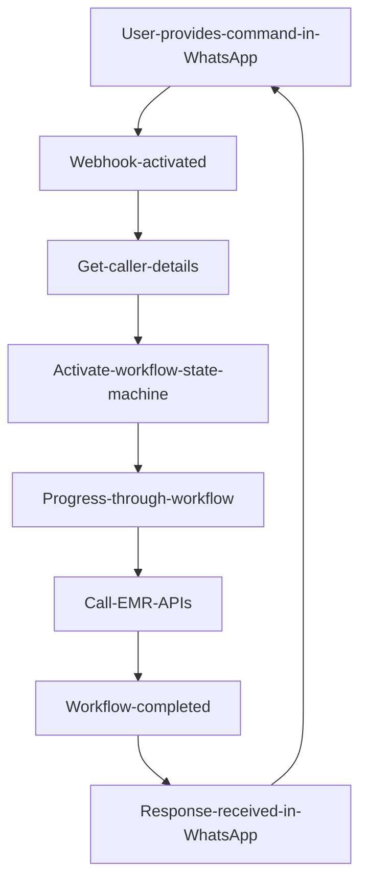

# How chatbots are transforming Healthcare

The healthcare industry is under immense pressure for over past few years and needs to embrace digital transformation to scale up and provide equitable healthcare access. There is no other better channel than **WhatsApp** in delivering equitable access to healthcare, an app which is most widely used across the planet. By deploying WhatsApp chatbots for healthcare we could do following:

**Booking appointment**

Patients can book appointment video/in-person with doctor of respective department from available schedule without having the need of visiting hospital and spend time at registration desk. In case of video appointment, there is no need to visit hospital at all for first consultation. Popular platforms such as WhatsApp video can be used for remote consultation.

**Odd hour support**

With the help of WhatsApp Bot provided hospital supports availability of doctors during odd hours, quick remote consultation can be setup with just a ping in a most natural way. No need to download any app.

**Uploading documents**

Users can use WhatsApp bot to send necessary documents directly over the bot instead of having to email care providers, eventually building health history at every possible interaction thus reducing the fear and eliminating the consequences of having left their documents at home, which leads to higher levels of customer satisfaction.

**Important reminders**

Such as, appointment reminders, medicine reminders, food and exercise schedule to users in a most seamless manner.

**Sharing digital copies of health records**

Such as, prescriptions, bills, reports etc.. digitally. They can be accessed by patients at any time by simply issuing a command to the bot.

**Making payments**

Waiting in line at a hospital to book medical consultations and pay for them can be quite annoying. Post online registration and appointment, payments can also be done in a seamless manner over WhatsApp Bot.

# What does existing solution do to help patients and care providers?

Existing solution enables care providers such as small hospitals, clinics or even individual doctors to deliver patient experience over WhatsApp in terms of:
1. Online registration
2. Profile update such as Photo and Address.
3. Online appointment
4. In person appointment
5. Viewing health record history
6. Viewing upcoming appointments

In addition to above capabilities, it provides additional endpoints which care providers EMR/HMS can leverage to send various types of information back to patient WhatsApp. They could reminders related to appointment, billing, medicines or general followup with patients to keep the engagement going.

**Activating services of a given care provider**

Just type: **hi hospitalcode or hello hospitalcode**. Additional activation commands can be introduced. Service is designed in a way, where a given care provider has multiple locations, each location can be managed separately and can be activated through assigned code by just typing hi hospitalcode.


**Video appointment booking workflow**


**Reminders - Feedback example**


# Solution architecture

**Dependencies**

- Twilio PHP SKD (composer.json). Upon running composer, twilio sdk folder should be added as part of the solution. More details on Twilio and PHP integration can be found here: https://www.twilio.com/docs/libraries/php 
```
{
    "require": {
        "twilio/sdk": "^6.25"
    }
}

// After running composer, including twilio SDK files
require_once __DIR__ . '/vendor/autoload.php';
use Twilio\Rest\Client;
```

- Memcache - to store hospital codes, details and other static information
- Underlying EMR/HMS used by care providers. It has plug/play capabilities with any EMR and can communicate using API's. For example, see **dataadapter.php** with references to underlying API's that EMR should support.
```
    // Underlying EHR API endpoints
    private $matchMobileNumberAPI = "<existing-userid-check-api-using-mobile-number>";
    private $registerPatientAPI = "<patient-registration-api>";
    private $patientupcomingApptAPI = "<upcoming-appointments-api>";
    private $getDeptsByHidAPI = "<get-hospital-departments-api>";
    private $getDocsByHidAndDeptIdAPI = "<get-hospital-department-doctors-api>";
    private $bookAppInPersonAPI = "<book-in-person-appointment-api>";
    private $bookApptVideoAPI = "<book-video-appointment-api>";
    private $getHealthRecordsAPI = "get-health-records-api>";
    private $updatePatientProfilePicAPI = "<upload-user-profile-pic-api>";
```


**Other dependencies**

- This solution has a mini database of its own to manage hospitals, ongoing workflows, and additional scenario's like - managing medicine requests etc. I have used MySQL in this case. 


- All static messages are driven from file **messageresources.php**.
- There are few dynamic messages that are returned from underlying EMR API endpoints.
- It will require Twilio setup. Docs for Twilio and PHP setup can be found here: https://www.twilio.com/docs/whatsapp/quickstart/python


**High level flow**



# Please remember
This solution will not work as-is. It will require:
1. Twilio setup. You can first start with Twilio sandbox and by configuring webhook.
2. MySql or some other relational database setup. Atleast one hospital entry in hospital domain table.
3. Underlying EMR and required API's. However you can mock the response and get the WhatsApp bot up and running for demonstration purposes.

# Opportunity ahead ...
1. Care providers who don't have EMR of their own, there is an opportunity to extend this solution and extend bot/admin database to hold additional details required for light weight EMR, in terms of, patient CRM, appointments, schedules, reminders etc.
2. There is also an opportunity to integrate this with available open source EMR's.
3. Additional scenario's for medicine delivery, lab tests etc.. can be extended.

# Is it currently operational?
Yes, it is currently operational in 50+ small hospitals and clinics with great outcomes:
1. Reduced registration/appointment physical queues.
2. Increased use of video appointments.
3. Enhanced patient engagement.
